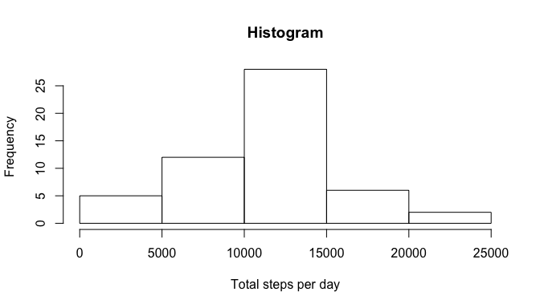
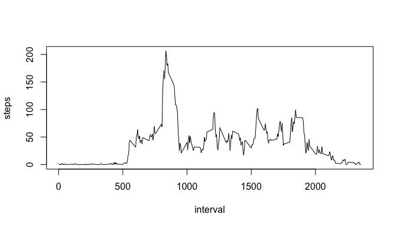
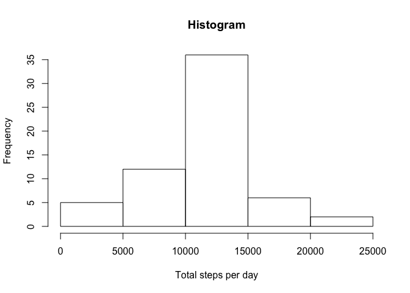
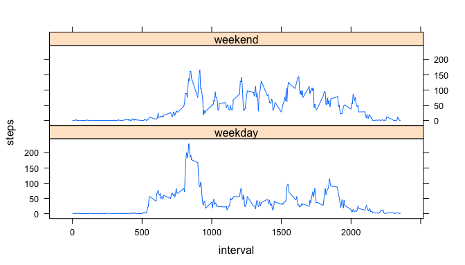

# Reproducible Research: Peer Assessment 1
Steven Lowen  

## Loading and preprocessing the data

First we set global options and download the data.
The zipped data is stored in a temporary file that is removed
after reading in the data.

```r
url <- "https://d396qusza40orc.cloudfront.net/repdata%2Fdata%2Factivity.zip"
temp <- tempfile()
download.file(url, temp, method="curl")
activity <- read.csv(unz(temp, "activity.csv"))
unlink(temp)
```

## What is mean total number of steps taken per day?
Next we aggregate by date using sum, and plot the histogram of
total number of steps per day

```r
totalsteps <- aggregate(steps ~ date, data = activity, sum)
hist(totalsteps$steps, xlab="Total steps per day", main="Histogram")
```

 


Now we compute the mean and median of this aggregated data, and 
save them for later use

```r
avgstep.orig <- mean(totalsteps$steps)
medstep.orig <- median(totalsteps$steps)
avgstep.orig
```

```
## [1] 10766.19
```

```r
medstep.orig
```

```
## [1] 10765
```

## What is the average daily activity pattern?
Next we aggregate by interval using mean, and plot the number of
steps per interval averaged over days

```r
dailysteps <- aggregate(steps ~ interval, data = activity, mean)
plot(dailysteps, type="l")
```

 

Now we determine the interval that has the largest number of
steps averaged over the day

```r
maxidx <- which.max(dailysteps$steps)
dailysteps$interval[maxidx]
```

```
## [1] 835
```

## Imputing missing values
Next we calculate and report the total number of missing values
in the dataset (i.e. the total number of rows with NAs)

```r
sum(!complete.cases(activity))
```

```
## [1] 2304
```

Before imputing the missing values, see which columns have
missing values

```r
for (i in 1:ncol(activity)){
    tmp <- sum(is.na(activity[,i]))
    cat("variable '", names(activity)[i], "' has ", tmp, " missing values\n",
        sep="")
}
```

```
## variable 'steps' has 2304 missing values
## variable 'date' has 0 missing values
## variable 'interval' has 0 missing values
```
So we only need to impute the varable 'steps'

To impute this variable, we employ the strategy of using the
mean value at the same interval, computed from non-missing days

```r
imputed <- activity
for (i in 1:nrow(imputed)) {
    if(is.na(imputed$steps[i])) {
        imputed$steps[i] <-
            dailysteps$steps[which(dailysteps$interval==imputed$interval[i])]
    }
}
```

Now we make a histogram of the total number of steps taken each
day, using the imputed data

```r
totalsteps <- aggregate(steps ~ date, data = imputed, sum)
hist(totalsteps$steps, xlab="Total steps per day", main="Histogram")
```

 

Now we calculate and report the mean and median total number of
steps taken per day, still using the imputed data.

```r
avgstep.imp <- mean(totalsteps$steps)
medstep.imp <- median(totalsteps$steps)
avgstep.imp
```

```
## [1] 10766.19
```

```r
medstep.imp
```

```
## [1] 10766.19
```

Next we see how these values differ from the estimates from the
first part of the assignment, and ascertain the impact of
imputing missing data on the estimates of the total daily number
of steps.

```r
require(xtable)
```

```
## Loading required package: xtable
```

```r
temp <- data.frame(c(avgstep.orig,medstep.orig),c(avgstep.imp,medstep.imp))
names(temp) <- c("original", "imputed")
rownames(temp) <- c("mean", "median")
temp$difference <- temp$imputed-temp$original
mytable <- xtable(temp)
print(mytable, type="html")
```

<!-- html table generated in R 3.2.3 by xtable 1.8-0 package -->
<!-- Fri Dec 18 20:52:24 2015 -->
<table border=1>
<tr> <th>  </th> <th> original </th> <th> imputed </th> <th> difference </th>  </tr>
  <tr> <td align="right"> mean </td> <td align="right"> 10766.19 </td> <td align="right"> 10766.19 </td> <td align="right"> 0.00 </td> </tr>
  <tr> <td align="right"> median </td> <td align="right"> 10765.00 </td> <td align="right"> 10766.19 </td> <td align="right"> 1.19 </td> </tr>
   </table>
The means are identical, by construction (missing values were
replaced by means for those intervals), but the medians differ.

What is the impact of imputing missing data on the estimates of
the total daily number of steps?
Imputing changes the data in ways that depend on the specific
locations of the missing data, and which may not be readily
predictable at the outset.
While the differences are small for the data at hand, in general
this may not be the case.

## Are there differences in activity patterns between weekdays and weekends?
We use the weekdays() function to turn the calendar date into
the day of the week, and use the first character to indicate
that it is during the weekend.

```r
imputed$day <- ifelse(substr(weekdays(as.Date(imputed$date)), 1, 1)=="S",
    "weekend", "weekday")
```
Then we aggregate by interval and day type using mean, applied
to the imputed data

```r
dailysteps <- aggregate(steps ~ interval + day, data = imputed, mean)
```
Finally we make a panel plot of this aggregated data

```r
require(lattice)
```

```
## Loading required package: lattice
```

```r
myplot <- xyplot(steps ~ interval|day, data = dailysteps, type="l", layout=c(1,2))
print(myplot)
```

 

showing that there is indeed a difference between weekdays and
weekends.
